# Smart Sales Systems — Role Workflows

> Developer-facing visualisation of **what each role actually does**, separated into **first-time** (onboarding / setup) and **returning** (typical day) flows. Each diagram is rendered as Mermaid — VSCode (with the Mermaid Preview extension) and GitHub render these natively.
>
> The role taxonomy this doc visualises is defined in [`roles_and_access.md`](./roles_and_access.md). Intake channels are in [`query_intake_channels.md`](./query_intake_channels.md). For per-role endpoint and page details see [`api_contracts.md`](./api_contracts.md) and the per-role skills under [`skills/`](./skills/).

---

## 0. Legend & conventions

```
🟦  User-driven action
🟩  System-driven action / async background
🟧  Decision branch
🟥  Failure / blocked state
✉️  Email side-effect
🔔  In-app notification
🔒  Auth / permission gate
🤖  AI / Judge / RAG step
```

In the diagrams:
- `1️⃣ First-time` flows happen on the very first session after the user is created.
- `🔁 Returning` flows are what they see every subsequent visit.
- Cross-role flows in §15 show how a single customer query traverses multiple roles.

---

## 1. Admin

### 1.1 First-time

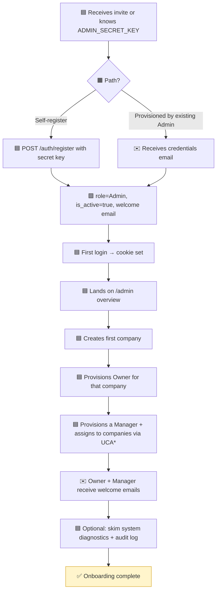

> *UCA = `user_company_assignments` (the join table that enables multi-company for Manager / Agent / Reviewer / Curator).*

### 1.2 Returning

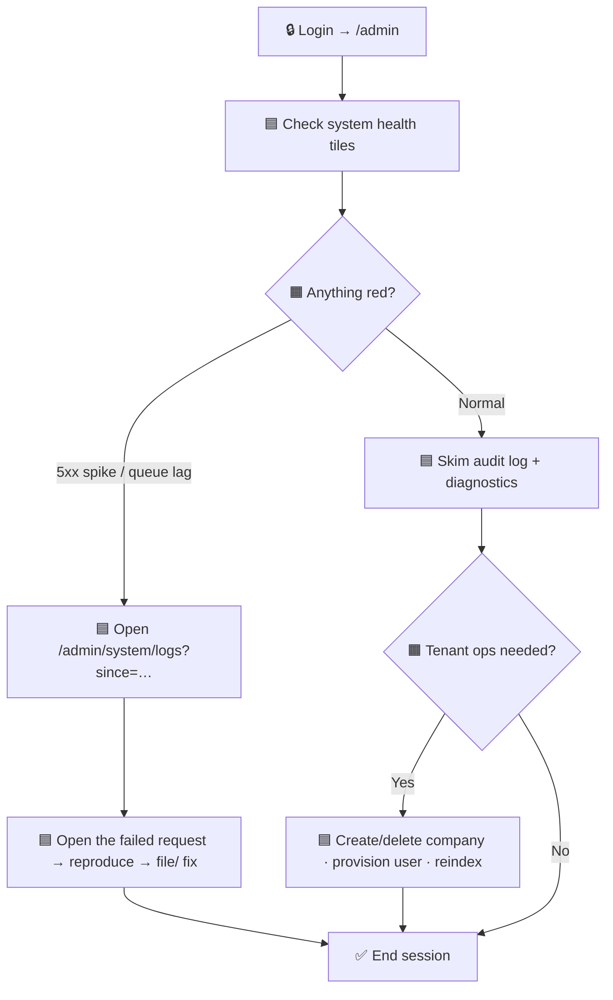

---

## 2. Auditor

### 2.1 First-time

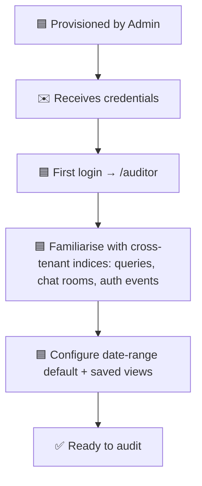

### 2.2 Returning

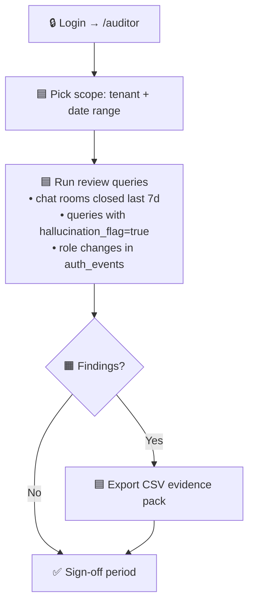

> The guard rejects every non-GET / non-export method, so the only side-effect is the export record.

---

## 3. Billing

### 3.1 First-time

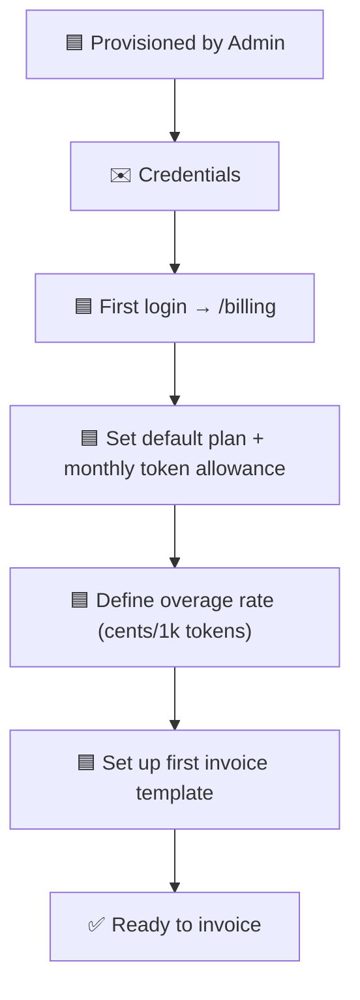

### 3.2 Returning

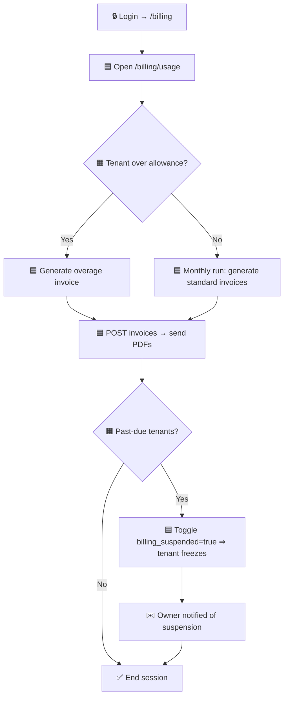

---

## 4. Owner

### 4.1 First-time

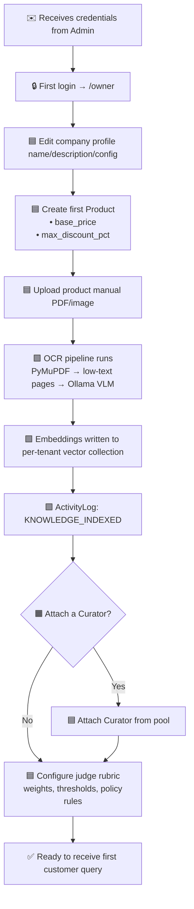

### 4.2 Returning

```mermaid
flowchart TD
    A[🔒 Login → /owner] --> B[🟦 Skim stats tiles\nescalations, products missing docs, high-priority pending]
    B --> C{🟧 Pending negotiations?}
    C -- "Yes" --> D[🟦 Open /owner/negotiations]
    D --> E[🟦 Read query + AI draft + thread]
    E --> F{🟧 Action?}
    F -- "Resolve in writing" --> G[🟦 POST /owner/negotiations/&#123;id&#125;/resolve]
    F -- "Need synchronous talk" --> H[🟦 Schedule chat room]
    G --> I[✉️ Customer receives official response]
    H --> J[✉️ Owner + Customer get secret keys]
    J --> K[🔁 Enter room at start_at → chat → resolve]
    I --> L[✅ End session]
    K --> L
    C -- "No" --> M{🟧 Catalog updates?}
    M -- "Yes" --> N[🟦 Add/edit products · upload/delete docs ⇒ reindex]
    M -- "No" --> L
    N --> L
```

---

## 5. Curator

### 5.1 First-time

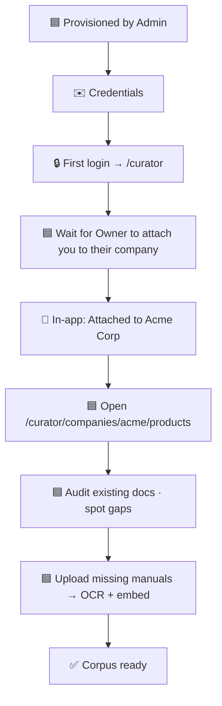

### 5.2 Returning

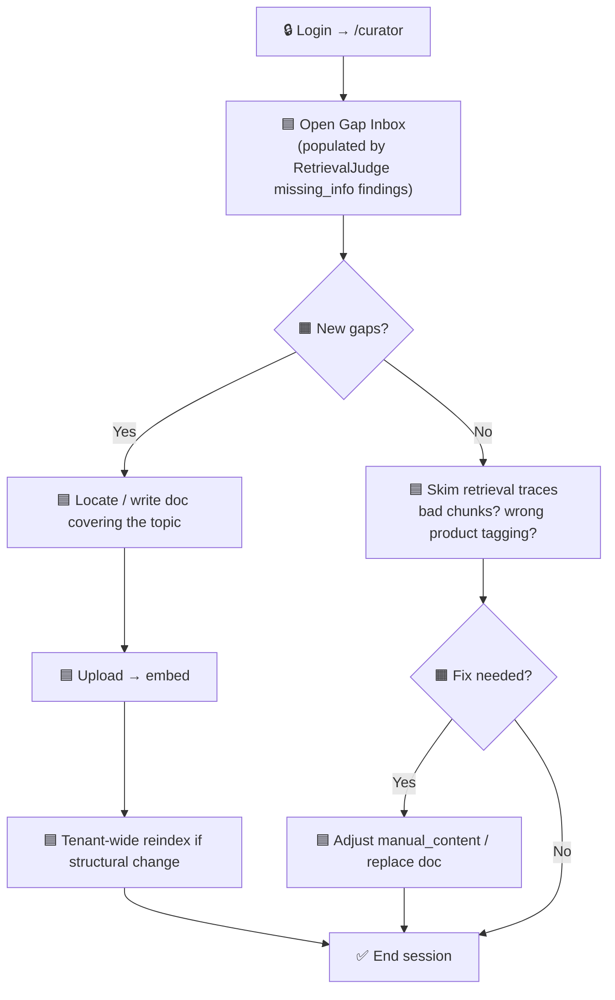

---

## 6. Manager

### 6.1 First-time

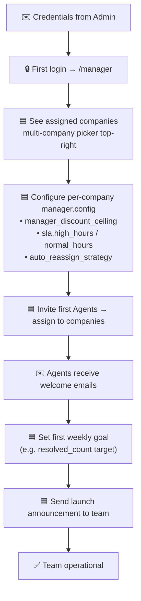

### 6.2 Returning

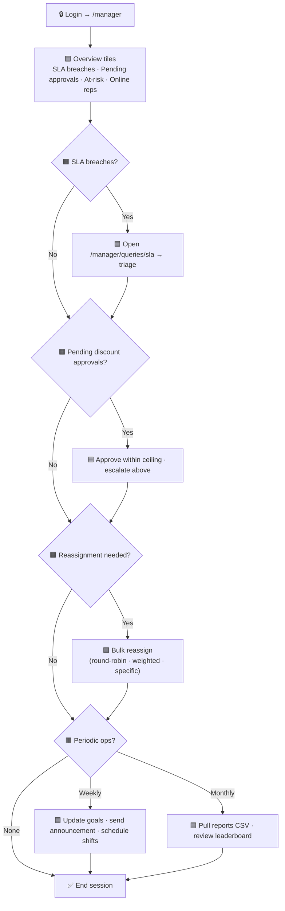

---

## 7. Reviewer

### 7.1 First-time

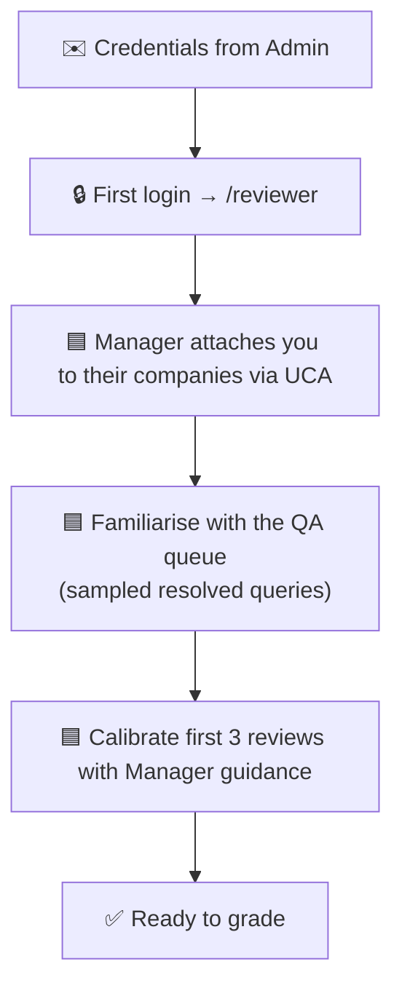

### 7.2 Returning

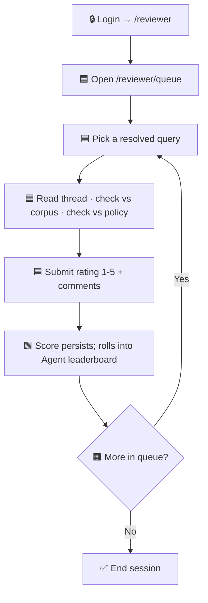

---

## 8. Agent (formerly SalesRep)

### 8.1 First-time

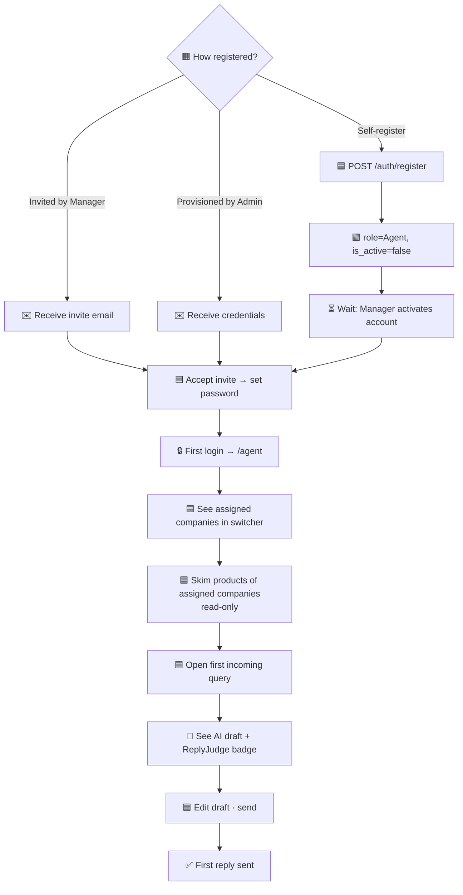

### 8.2 Returning — happy path

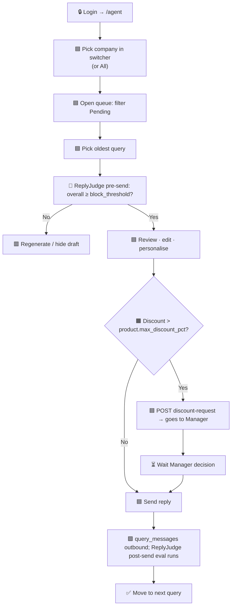

### 8.3 Returning — customer unhappy (2-strike → escalation)

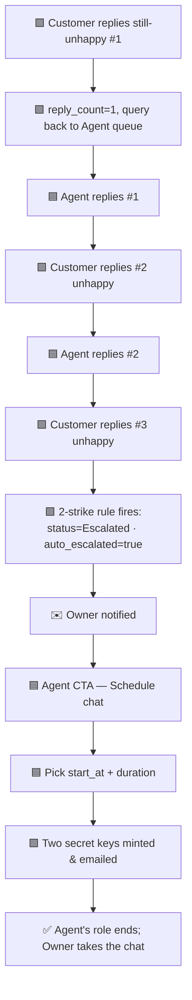

---

## 9. Customer (account-holder)

### 9.1 First-time

```mermaid
flowchart TD
    A[🟦 Land on company website / portal] --> B[🟦 POST /auth/register/customer]
    B --> C[✉️ Verification email]
    C --> D[🟦 Click link → POST /auth/verify-email/&#123;token&#125;]
    D --> E[🔒 First login → /customer]
    E --> F[🟦 Browse company directory]
    F --> G[🟦 Open /customer/ask → pick company + product → describe issue]
    G --> H[🟩 intake_query channel=portal · customer_user_id=me]
    H --> I[🤖 RAG draft generated]
    I --> J[🟩 Agent picks up · sends edited reply]
    J --> K[🔔 Customer notified in portal + ✉️ optional email]
    K --> L[✅ First query in flight]
```

### 9.2 Returning

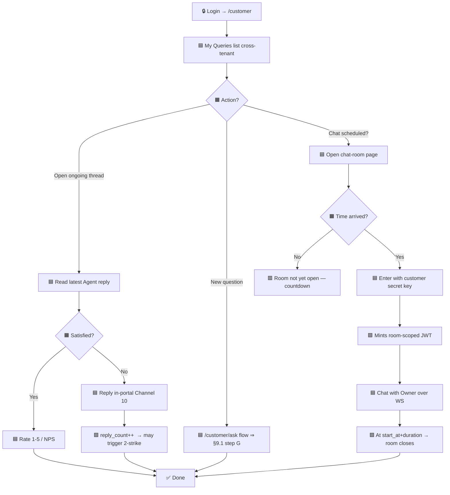

---

## 10. Guest (no account — anonymous webhook intake)

### 10.1 First-time = every-time (no notion of "returning")

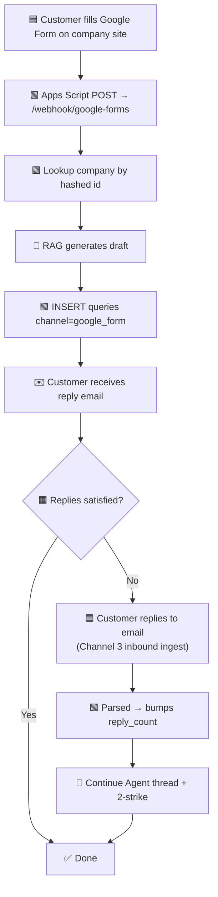

### 10.2 Guest enters a scheduled chat (after escalation)

```mermaid
flowchart TD
    A[✉️ Email arrives with customer secret key + room URL] --> B[🟦 Open URL]
    B --> C{🟧 start_at reached?}
    C -- "No" --> D[🟥 Countdown screen]
    C -- "Yes" --> E[🟦 Paste secret key]
    E --> F[🟩 Server validates · mints room-scoped JWT]
    F --> G[🟦 Chat with Owner]
    G --> H[🟩 Room closes at start_at+duration]
    H --> I[✅ Transcript archived]
```

---

## 11. ReplyJudge (system agent)

### 11.1 Per-query lifecycle

```mermaid
flowchart TD
    A[🟩 RAG produces ai_draft for a query] --> B[🤖 Pre-send judge call\nmodel = JUDGE_MODEL]
    B --> C[🟩 Score persisted to judge_scores target=ai_draft]
    C --> D{🟧 overall vs thresholds}
    D -- "< block_threshold OR hallucination_flag" --> E[🟥 Hide draft · regen · count failures]
    D -- "< warn_threshold" --> F[⚠️ Show with warning chip]
    D -- "≥ warn" --> G[✅ Show normally]
    E --> H{🟧 Failures ≥ 3?}
    H -- "Yes" --> I[🔔 Escalate to Owner with reason]
    H -- "No" --> A
    F --> J[🟦 Agent edits + sends]
    G --> J
    J --> K[🤖 Post-send judge eval on final_reply]
    K --> L[🟩 Score persisted target=final_reply ⇒ feeds analytics + Reviewer queue]
```

### 11.2 Nightly batch

```mermaid
flowchart TD
    A[🟩 Cron at 02:00 UTC per tenant] --> B[🟩 Sample N queries from last 24h]
    B --> C[🤖 Re-grade with current rubric_version]
    C --> D[🟩 Append to judge_scores]
    D --> E[🟩 Aggregate trend report ⇒ Owner dashboard + Auditor]
```

---

## 12. RetrievalJudge (system agent)

### 12.1 Per-query lifecycle

```mermaid
flowchart TD
    A[🟩 RAG retrieves top-k from tenant vector store] --> B[🤖 Online cross-encoder rerank]
    B --> C[🟩 chunk_relevance scores persisted]
    C --> D[🟦 Reordered chunks → generator]
    D --> E{🟧 Sampled for offline judge? sample_rate}
    E -- "No" --> F[✅ Done]
    E -- "Yes" --> G[🟩 Queue job: query + chunks]
    G --> H[🤖 LLM rubric: coverage · redundancy · missing_info · wrong_product]
    H --> I[🟩 Persist retriever_scores]
    I --> J{🟧 missing_info==true?}
    J -- "Yes" --> K[🔔 Curator gap-inbox ticket]
    J -- "No" --> L{🟧 wrong_product==true?}
    L -- "Yes" --> M[🔔 Flag metadata for review]
    L -- "No" --> N{🟧 avg chunk_relevance < threshold?}
    N -- "Yes" --> O["🟩 Trigger re-embedding job\n(different chunk size / model)"]
    N -- "No" --> F
    K --> F
    M --> F
    O --> F
```

---

## 13. Cross-role — end-to-end customer query (happy path)

```mermaid
sequenceDiagram
    participant C as 👤 Customer / Guest
    participant W as Webhook / Portal
    participant R as 🤖 RAG + RetrievalJudge
    participant J as 🤖 ReplyJudge
    participant A as 👤 Agent
    participant DB as 🗄️ Queries DB
    participant ES as ✉️ Email/WS

    C->>W: 1. Submit query (Channel 1..10)
    W->>DB: 2. intake_query() inserts Query + inbound message
    W->>R: 3. Retrieve top-k from tenant vector store
    R->>R: 4. Online rerank → grounded prompt
    R->>J: 5. ai_draft generated → judge pre-send
    J-->>R: 6. score, pass / warn / block
    R->>DB: 7. Persist ai_generated_answer + judge_scores
    DB->>A: 8. Query appears in Agent queue
    A->>A: 9. Review draft + judge badge → edit
    A->>DB: 10. POST /agent/queries/{id}/send → outbound message
    A->>J: 11. Post-send judge eval (background)
    A->>ES: 12. Outbound dispatched on the same channel
    ES->>C: 13. Customer receives reply
    C-->>A: 14. (optional) Satisfied → no follow-up = Resolved
```

---

## 14. Cross-role — escalation via 2-strike → scheduled chat → resolution

```mermaid
sequenceDiagram
    participant C as 👤 Customer
    participant A as 👤 Agent
    participant DB as 🗄️ Queries DB
    participant O as 👤 Owner
    participant ES as ✉️ Email
    participant WS as 🔌 WS /ws/chat/{room}

    C->>A: Reply #1 unhappy
    A->>C: Reply #1
    C->>A: Reply #2 unhappy
    A->>C: Reply #2
    C->>A: Reply #3 unhappy
    A->>DB: reply_count=3 → 2-strike rule
    DB->>DB: status=Escalated · auto_escalated=true
    DB->>O: Notification + email
    A->>DB: POST /agent/queries/{id}/schedule-chat\n  {start_at, duration_min}
    DB->>DB: Create chat_room (state=scheduled)\nHash + store two secret keys
    DB->>ES: ✉️ Owner key
    DB->>ES: ✉️ Customer key
    Note over O,C: ⏳ Wait until start_at
    O->>DB: POST /owner/chat-rooms/{id}/enter (owner_secret_key)
    DB-->>O: room-scoped JWT
    C->>DB: POST /customer/chat-rooms/{id}/enter (customer_secret_key)
    DB-->>C: room-scoped JWT
    DB->>DB: state=open
    O->>WS: connect with JWT
    C->>WS: connect with JWT
    par live chat
        O->>C: message via WS
        C->>O: message via WS
    end
    Note over DB: start_at + duration reached
    DB->>DB: state=closed, transcript archived
    O->>DB: POST /owner/negotiations/{id}/resolve (summary)
    DB->>ES: ✉️ Customer receives formal closure
```

---

## 15. Cross-role — discount cascade

```mermaid
flowchart TD
    A[👤 Agent: discount > product.max_discount_pct] --> B[🟦 POST /agent/queries/&#123;id&#125;/discount-request]
    B --> C[🟩 DiscountApproval row pending]
    C --> D[🔔 Manager queue /manager/approvals]
    D --> E{🟧 requested_pct ≤ manager_discount_ceiling?}
    E -- "Yes" --> F[🟦 Manager approves]
    F --> G[🟩 status=approved · Agent notified · final_answer prepped]
    E -- "No" --> H[🟦 Manager escalates]
    H --> I[🟩 status=escalated_to_owner · spawn Owner negotiation]
    I --> J[🟦 Owner decides via /owner/negotiations]
    J --> G
    G --> K[🟦 Agent sends reply with approved discount]
    K --> L[✅ Done]
```

---

## 16. State machine — a single Query's lifecycle

```mermaid
stateDiagram-v2
    [*] --> Pending: intake_query()
    Pending --> Pending: reassign / priority changes
    Pending --> Resolved: agent resolves (≤2 customer replies)
    Pending --> Escalated: 2-strike fires OR manual escalate
    Escalated --> Resolved: owner negotiation resolved\nOR scheduled chat closes + owner summary
    Resolved --> [*]
    Escalated --> Escalated: chat room scheduled
```

---

## 17. State machine — a ChatRoom

```mermaid
stateDiagram-v2
    [*] --> scheduled: POST /schedule-chat
    scheduled --> cancelled: Owner or Agent cancels before start_at
    scheduled --> open: now ≥ start_at AND both keys validated (or just first)
    open --> closed: now ≥ start_at + duration_min
    cancelled --> [*]
    closed --> [*]
```

---

## 18. State machine — a DiscountApproval

```mermaid
stateDiagram-v2
    [*] --> pending: Agent requests
    pending --> approved: Manager approves (within ceiling)
    pending --> denied: Manager denies
    pending --> escalated_to_owner: Manager escalates OR requested > ceiling
    escalated_to_owner --> approved: Owner approves
    escalated_to_owner --> denied: Owner denies
    approved --> [*]
    denied --> [*]
```

---

## 19. Putting it together — "a day in the life" matrix

| Time of day      | Admin            | Auditor             | Billing             | Owner                          | Curator              | Manager                          | Reviewer             | Agent                              | Customer                  |
| ---------------- | ---------------- | ------------------- | ------------------- | ------------------------------ | -------------------- | -------------------------------- | -------------------- | ---------------------------------- | ------------------------- |
| **Start of day** | Scan diagnostics | Set scope           | Scan usage tiles    | Skim escalations               | Open gap inbox      | Review SLA breaches + approvals  | Open QA queue        | Pick company + open Pending queue  | Check My Queries          |
| **Mid-day**      | Provision a user | Run a sample audit  | Generate invoices   | Resolve a negotiation         | Upload a missing doc | Bulk-reassign · approve discounts| Grade 5 resolved     | Send replies · request discounts   | Reply to a thread         |
| **Afternoon**    | Reindex a tenant | Export CSV evidence | Suspend non-payer   | Enter scheduled chat           | Reindex tenant       | Update a goal · send announcement| Calibrate with Manager| Schedule a chat for hard escalation| Enter scheduled chat     |
| **End of day**   | Skim audit log   | Sign-off period     | Reconcile sends     | Review judge findings          | Verify retrieval traces| Pull weekly CSV                | Submit final grades  | Close out queue                    | Rate resolved queries     |

---

## 20. References

- Role taxonomy: [`roles_and_access.md`](./roles_and_access.md)
- Intake channels: [`query_intake_channels.md`](./query_intake_channels.md)
- Implementation status: [`roles_checklist.md`](./roles_checklist.md)
- Migration phases: [`state_preparation.md`](./state_preparation.md)
- API surface: [`api_contracts.md`](./api_contracts.md)
- CRUD operations: [`crud_operations.md`](./crud_operations.md)
- DB schema: [`db_schema.md`](./db_schema.md)
- Architecture: [`architecture.md`](./architecture.md)
- Integration skill (wiring backend ↔ frontend): [`skills/integration_skill.md`](./skills/integration_skill.md)
