# Smart Sales Systems — Workflow Visuals (PNG)

This folder contains pre-rendered PNG versions of every workflow diagram from [`../role_workflows.md`](../role_workflows.md). Use them in slide decks, onboarding docs, screenshots, or anywhere mermaid rendering isn't available.

> **To regenerate:** `python _render.py` (uses [mermaid.ink](https://mermaid.ink) — needs internet but no local Chromium). The script is idempotent; just rerun after any change to `role_workflows.md`.

---

## Index

### Per-role flows (first-time onboarding + returning user)

| # | Role          | First-time                                                    | Returning                                                       |
| - | ------------- | ------------------------------------------------------------- | --------------------------------------------------------------- |
| 1 | Admin         | 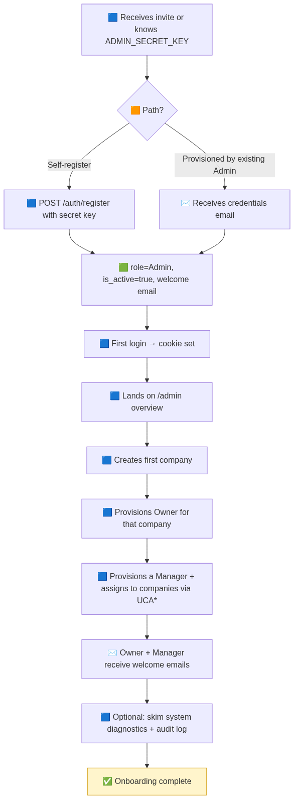                            | 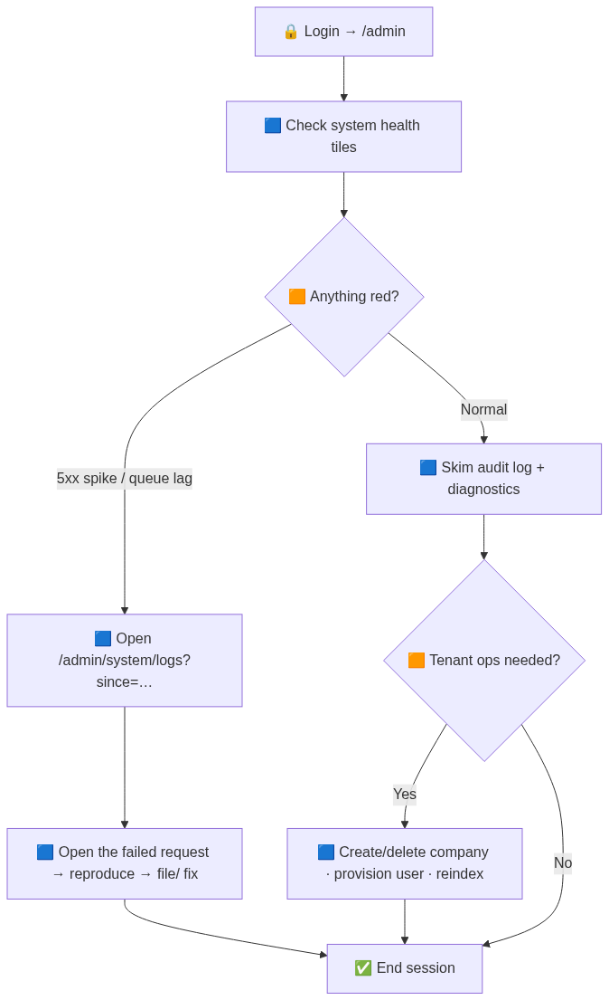                               |
| 2 | Auditor       | 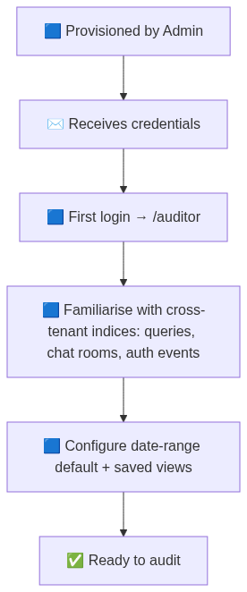                          | 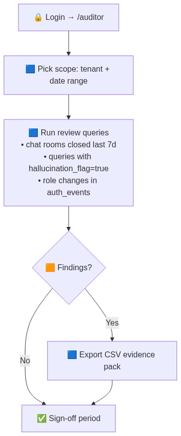                             |
| 3 | Billing       | 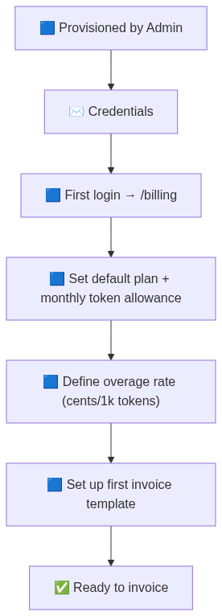                          | 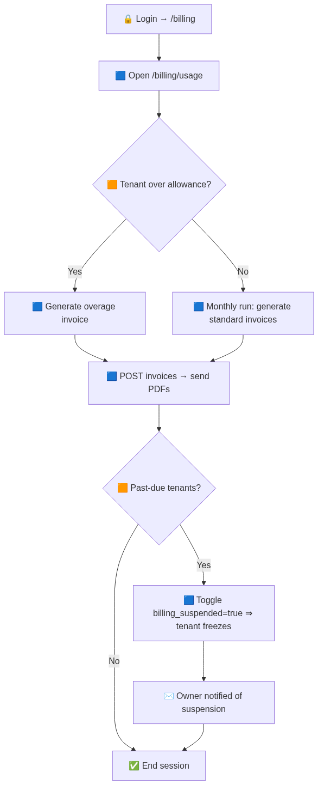                             |
| 4 | Owner         | 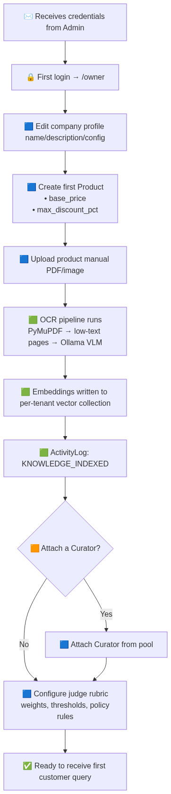                            | 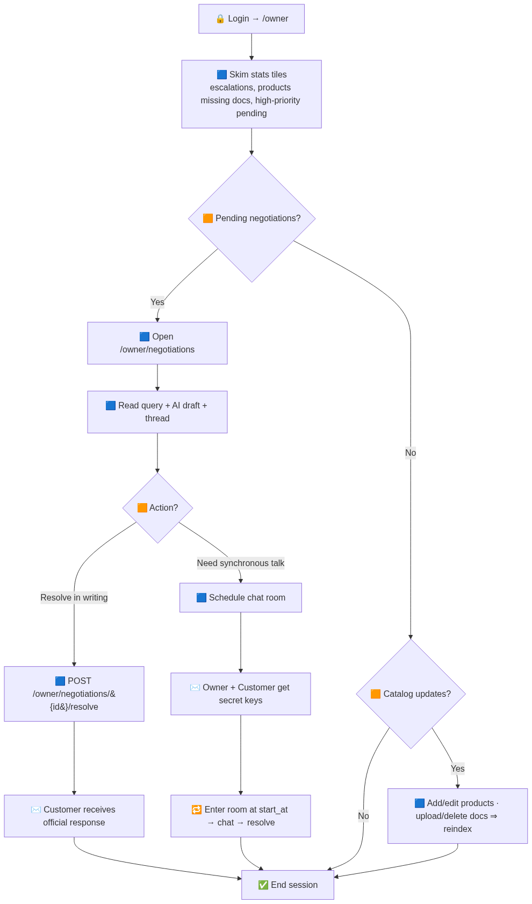                               |
| 5 | Curator       | 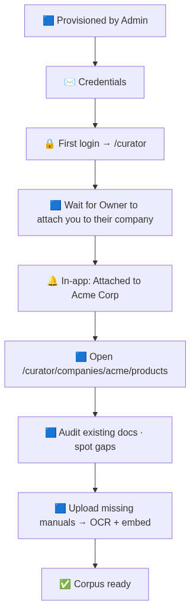                          | 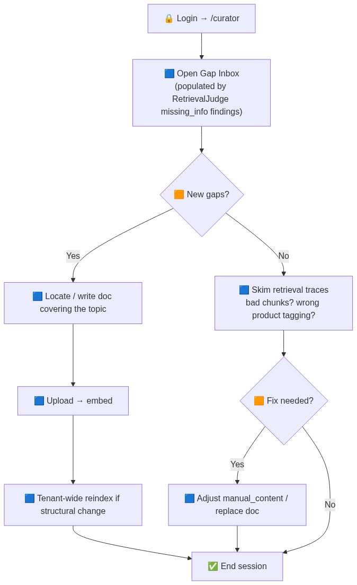                             |
| 6 | Manager       | 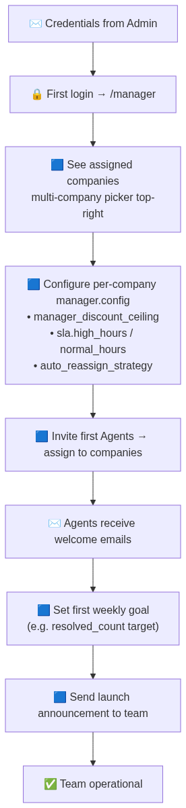                          | 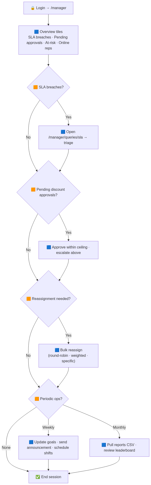                             |
| 7 | Reviewer      | 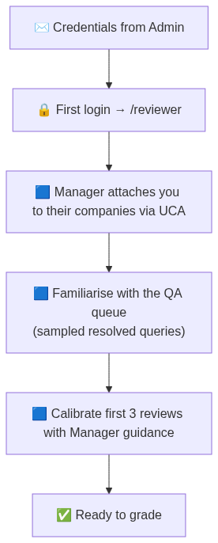                         | 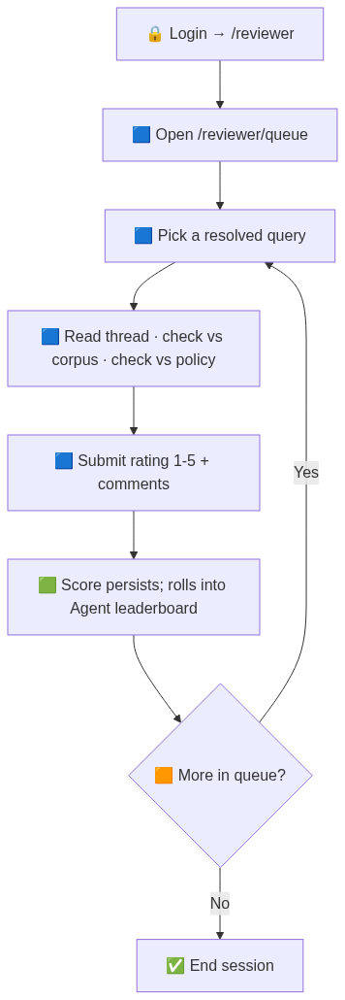                            |
| 8 | Agent         | 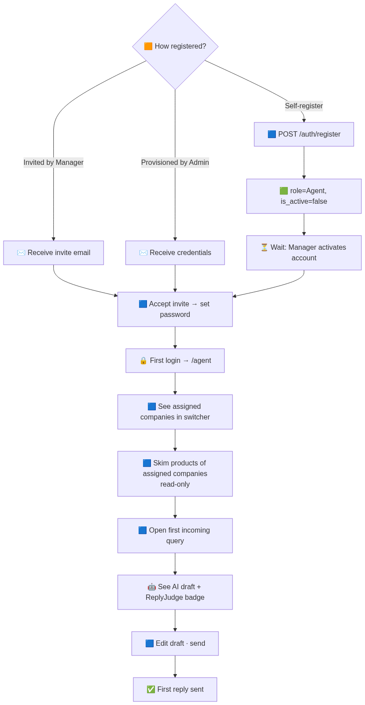          | 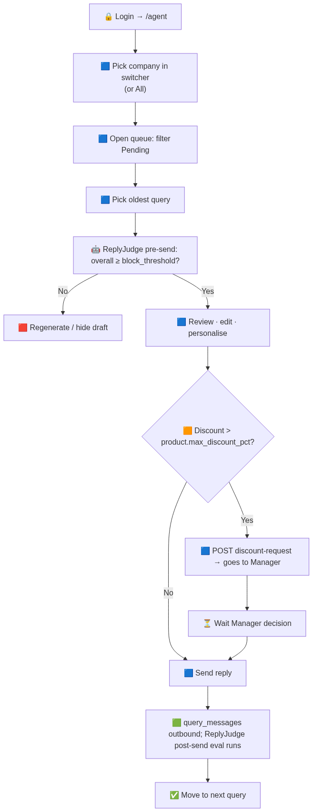 <br> 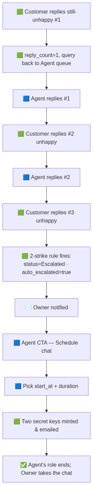 |
| 9 | Customer      | 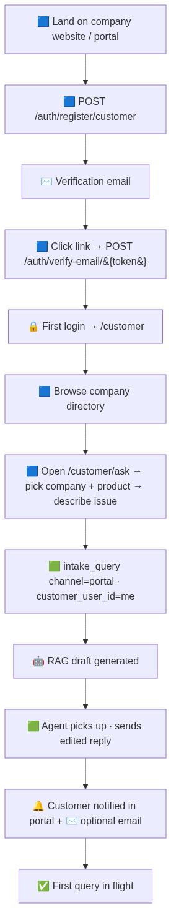          | 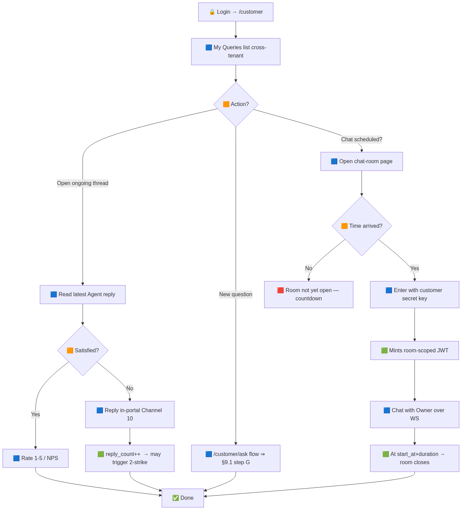             |
| 10| Guest         | 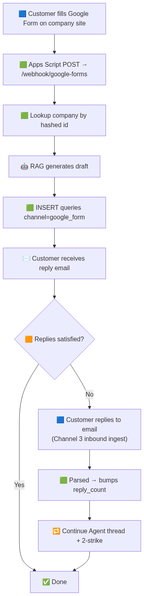 | 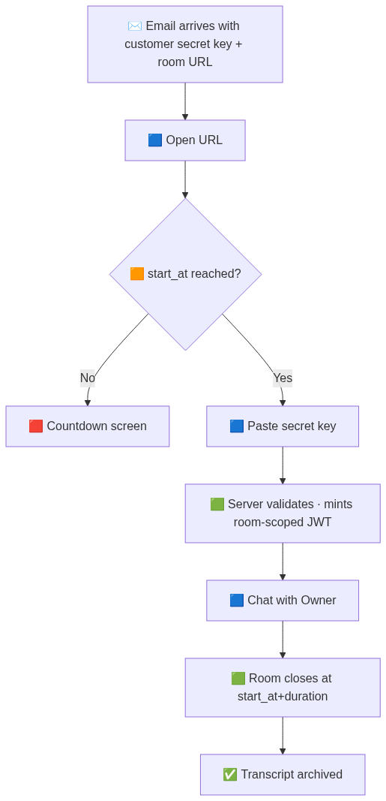 |
| 11| ReplyJudge    | 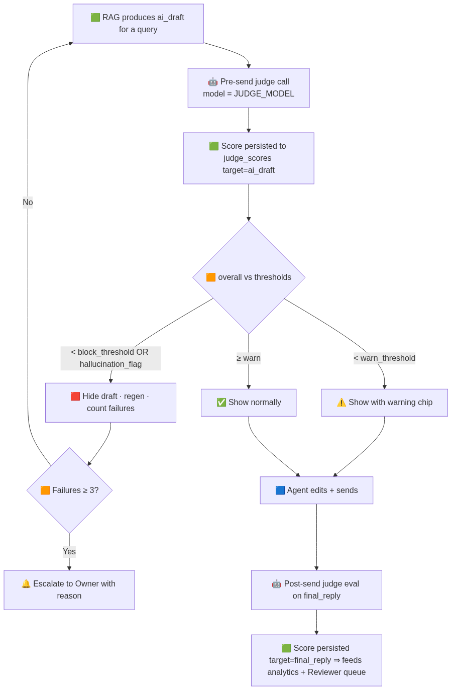 | 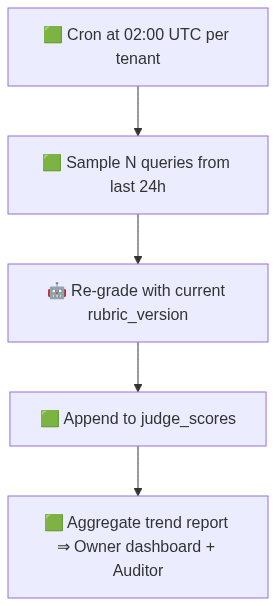        |
| 12| RetrievalJudge| 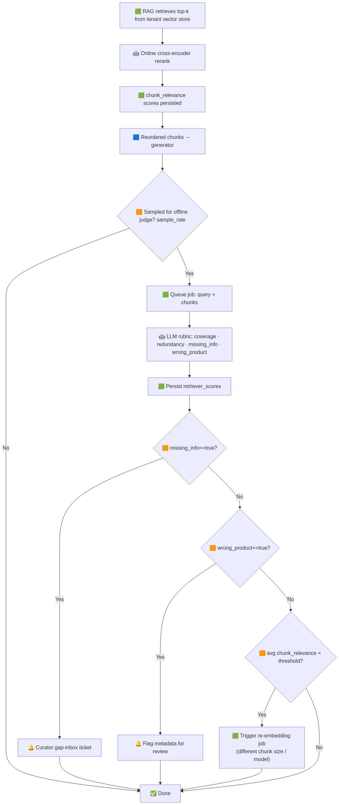 | *(no second flow)*                                          |

### Cross-role sequence diagrams

- **13** — End-to-end customer query (happy path): `13-cross-role-end-to-end-customer-query-happy-path.png`
- **14** — 2-strike → scheduled chat → resolution: `14-cross-role-escalation-via-2-strike-scheduled-chat-resolution.png`
- **15** — Discount cascade (Agent → Manager → Owner): `15-cross-role-discount-cascade.png`

### State machines

- **16** — Query lifecycle: `16-state-machine-a-single-querys-lifecycle.png`
- **17** — ChatRoom states: `17-state-machine-a-chatroom.png`
- **18** — DiscountApproval states: `18-state-machine-a-discountapproval.png`

---

## How the renderer works

`_render.py`:
1. Reads `../role_workflows.md`, extracts every ` ```mermaid ... ``` ` block.
2. Names each PNG from the nearest preceding `##` / `###` heading.
3. POSTs the source (URL-safe base64) to `https://mermaid.ink/img/<b64>?type=png` and writes the response bytes to disk.
4. Strips `\(` / `\)` markdown escapes that mermaid's parser rejects (preserves the source markdown's editor-preview compatibility).
5. Retries up to 3× on failure with backoff.

### Mermaid pitfalls to avoid when editing `role_workflows.md`

Anything inside a flowchart `[...]` node label must avoid these characters unless the whole label is wrapped in `"..."`:

- `(` `)` — interpreted as a different node shape
- `"` (inside the label) — terminates the quoted string
- `;` — statement separator (also valid inside sequence-diagram message text — replace with `,`)

If you need parens or quotes, wrap the label in double quotes:
```
A["🟦 Some label (with parens) and a quote"]
```

To embed actual double quotes, use the HTML entity:
```
A["He said &quot;hello&quot;"]
```
